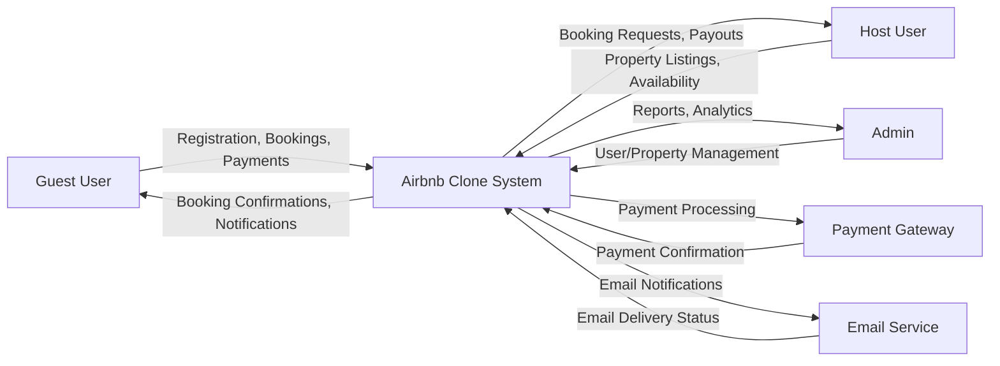
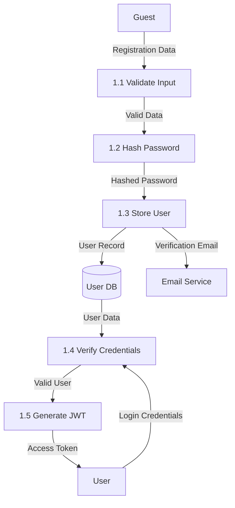
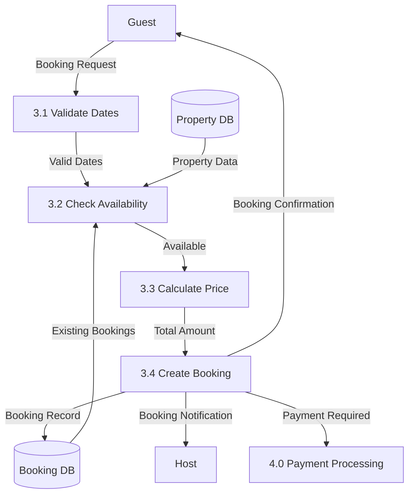
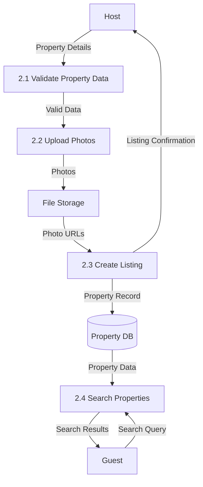
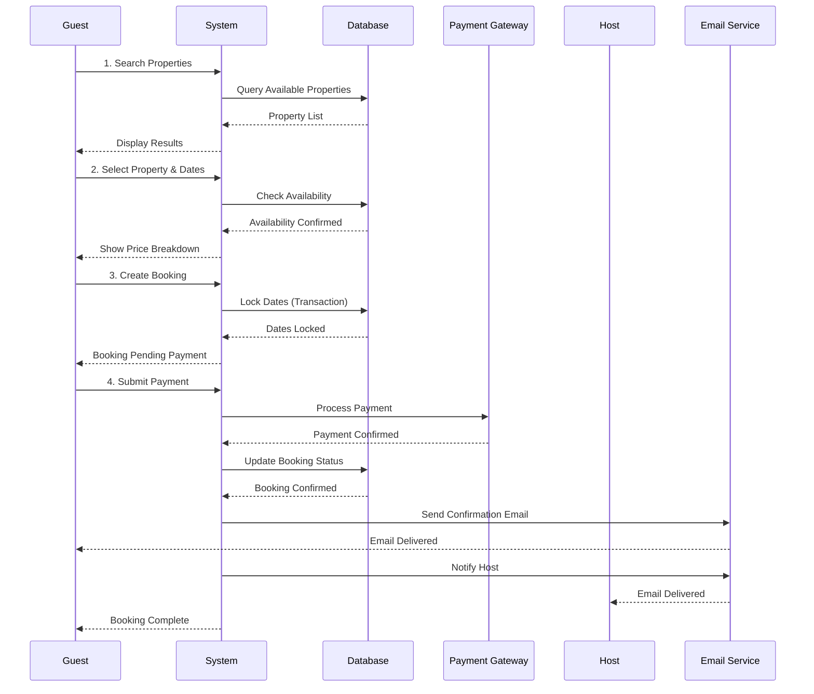

# Data Flow Diagram - Airbnb Clone Backend

## Level 0 - Context Diagram



## Level 1 - Major Processes

```mermaid
graph TB
    subgraph External Entities
        Guest[Guest]
        Host[Host]
        Admin[Admin]
        PayGW[Payment Gateway]
        Email[Email Service]
    end
    
    subgraph Processes
        P1[1.0 User Authentication]
        P2[2.0 Property Management]
        P3[3.0 Booking Management]
        P4[4.0 Payment Processing]
        P5[5.0 Review Management]
        P6[6.0 Messaging System]
    end
    
    subgraph Data Stores
        DS1[(User Database)]
        DS2[(Property Database)]
        DS3[(Booking Database)]
        DS4[(Payment Database)]
        DS5[(Review Database)]
        DS6[(Message Database)]
    end
    
    Guest -->|Login Credentials| P1
    Guest -->|Search Criteria| P2
    Guest -->|Booking Request| P3
    Guest -->|Payment Info| P4
    Guest -->|Review Data| P5
    Guest -->|Messages| P6
    
    Host -->|Property Details| P2
    Host -->|Availability| P3
    Host -->|Messages| P6
    
    Admin -->|Management Commands| P1
    Admin -->|Management Commands| P2
    Admin -->|Management Commands| P3
    
    P1 -->|User Data| DS1
    P2 -->|Property Data| DS2
    P3 -->|Booking Data| DS3
    P4 -->|Payment Data| DS4
    P5 -->|Review Data| DS5
    P6 -->|Message Data| DS6
    
    P4 <-->|Payment Request/Response| PayGW
    P1 -->|Email Request| Email
    P3 -->|Notification Request| Email
    P4 -->|Receipt Email| Email
```



## Level 2 - Detailed Process: User Authentication



## Level 2 - Detailed Process: Booking Management



## Level 2 - Detailed Process: Property Management



## Data Flow - Complete Booking Process



## Data Stores

### 1. User Database
**Stores:** User credentials, profiles, roles
**Accessed by:** Authentication, Profile Management, Booking processes
**Data:** user_id, email, password_hash, first_name, last_name, role, created_at

### 2. Property Database
**Stores:** Property listings, details, photos, amenities
**Accessed by:** Property Management, Search, Booking processes
**Data:** property_id, host_id, name, description, location, price, photos

### 3. Booking Database
**Stores:** Booking records, dates, status
**Accessed by:** Booking Management, Payment, Calendar processes
**Data:** booking_id, property_id, user_id, check_in, check_out, total_price, status

### 4. Payment Database
**Stores:** Payment transactions, receipts
**Accessed by:** Payment Processing, Refund processes
**Data:** payment_id, booking_id, amount, payment_method, status

### 5. Review Database
**Stores:** Guest reviews, ratings, comments
**Accessed by:** Review Management, Property Display
**Data:** review_id, property_id, user_id, rating, comment

### 6. Message Database
**Stores:** User-to-user messages
**Accessed by:** Messaging System
**Data:** message_id, sender_id, recipient_id, message_body, sent_at

## External Entities

### Input Data Flows
- **Guest → System:** Registration data, search queries, booking requests, payment info, reviews, messages
- **Host → System:** Property details, photos, availability updates, responses
- **Admin → System:** Management commands, user/property actions
- **Payment Gateway → System:** Payment confirmations, transaction status
- **Email Service → System:** Delivery status, bounce notifications

### Output Data Flows
- **System → Guest:** Search results, booking confirmations, payment receipts, notifications
- **System → Host:** Booking notifications, payment transfers, guest messages
- **System → Admin:** Analytics reports, system metrics
- **System → Payment Gateway:** Payment requests, refund requests
- **System → Email Service:** Notification emails, verification emails

## Data Flow Notation

```
┌─────────┐
│ Process │  = System Process (numbered)
└─────────┘

┌─────────┐
│ Entity  │  = External Entity
└─────────┘

  ┌───┐
  │DB │    = Data Store
  └───┘

  ───▶     = Data Flow (shows data movement)
```

---

**Author:** Jason Rippon  
**Date:** October 26, 2025  
**Project:** ALX Airbnb Clone Documentation
