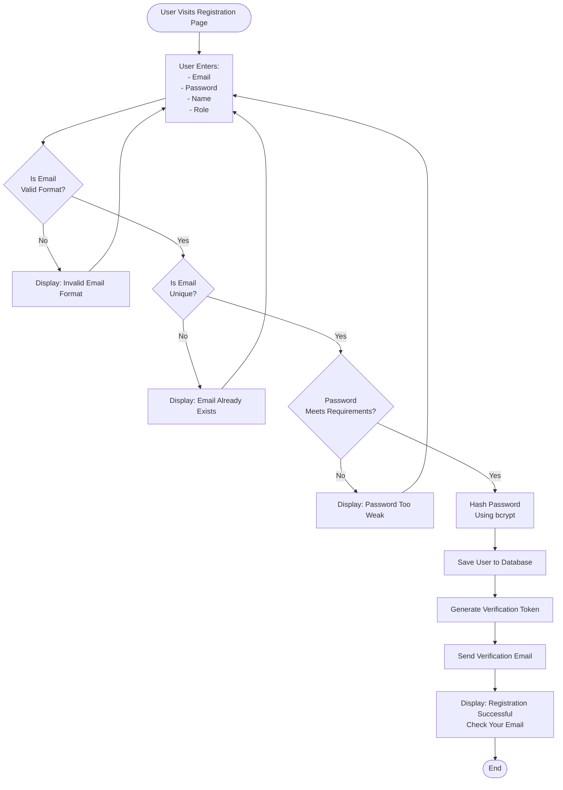
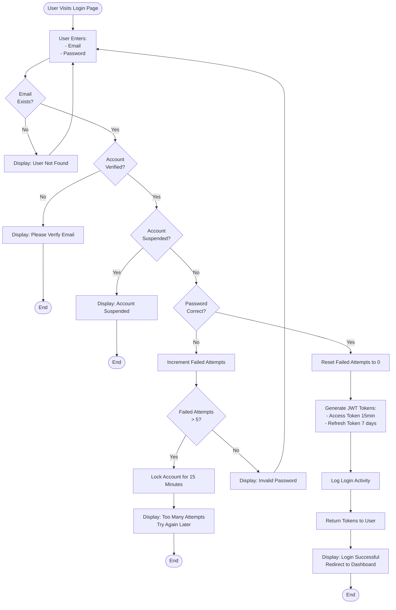
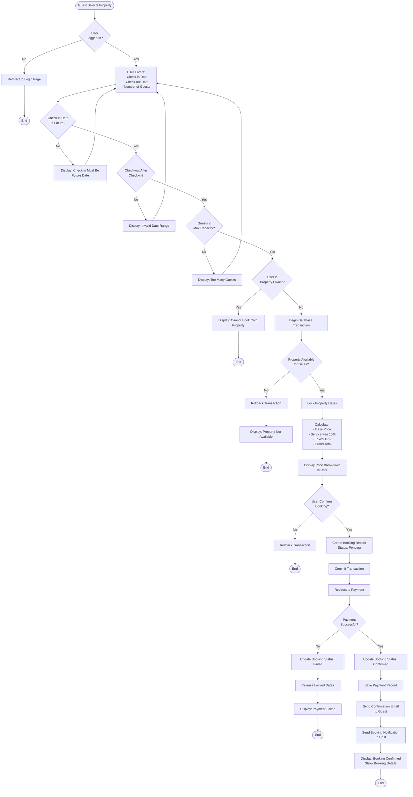
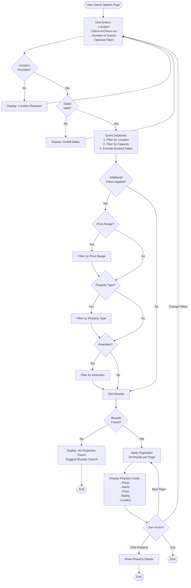
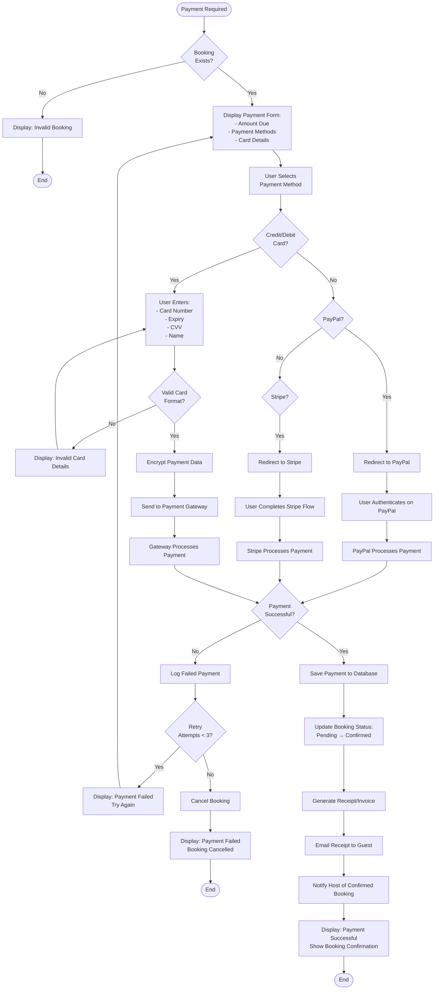
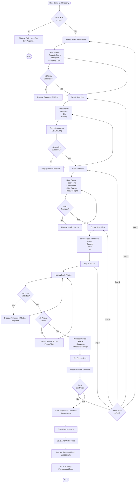
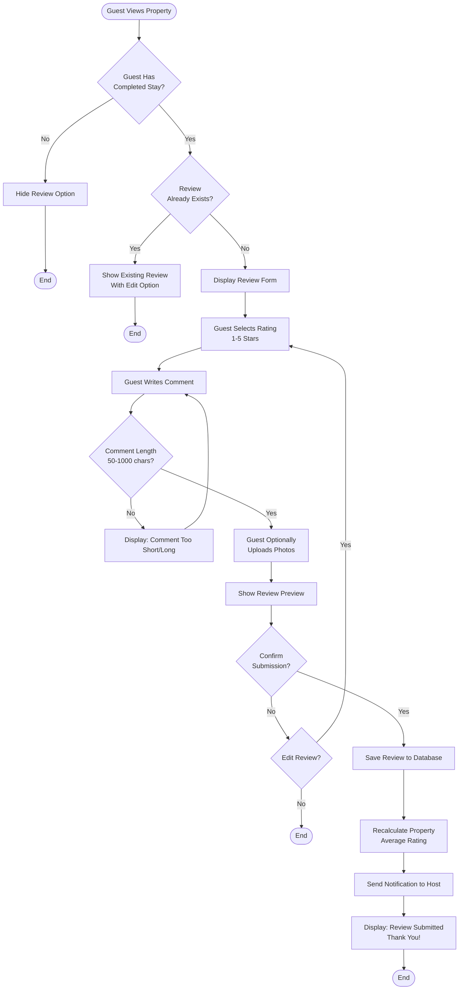

# Flowcharts - Airbnb Clone System Processes

## 1. User Registration Flowchart



## 2. User Login Flowchart



## 3. Property Booking Flowchart



## 4. Property Search Flowchart



## 5. Payment Processing Flowchart



## 6. Property Listing Creation Flowchart



## 7. Review Submission Flowchart



## Flowchart Legend

```
┌─────────┐
│ Process │  = Action/Process Step
└─────────┘

  ◇
 ╱ ╲      = Decision Point
╱   ╲
─────

 ╭───╮
 │End│    = Start/End Point
 ╰───╯

  ───▶    = Flow Direction
```

---

**Author:** Jason Rippon  
**Date:** October 26, 2025  
**Project:** ALX Airbnb Clone Documentation
