# Use Case Diagram - Airbnb Clone

## Visual Representation

```
                                    AIRBNB CLONE SYSTEM
                    ┌───────────────────────────────────────────────────┐
                    │                                                   │
                    │                                                   │
    ┌──────┐        │   ┌─────────────────┐      ┌─────────────────┐ │
    │      │────────┼──▶│  Register       │      │  Search         │◀┼────────┐
    │      │        │   │  Account        │      │  Properties     │ │        │
    │      │        │   └─────────────────┘      └─────────────────┘ │        │
    │      │        │                                                   │        │
    │      │        │   ┌─────────────────┐      ┌─────────────────┐ │        │
    │GUEST │────────┼──▶│  Login          │      │  View Property  │◀┼────────┤
    │      │        │   │  System         │      │  Details        │ │        │
    │      │        │   └─────────────────┘      └─────────────────┘ │        │
    │      │        │                                                   │        │
    │      │        │   ┌─────────────────┐      ┌─────────────────┐ │        │
    │      │────────┼──▶│  Make           │      │  Make           │◀┼────────┤
    │      │        │   │  Booking        │◀─────│  Payment        │ │        │
    │      │        │   └─────────────────┘      └─────────────────┘ │        │
    │      │        │          │                                       │        │
    │      │        │          │ includes                              │        │
    │      │        │          ▼                                       │        │
    │      │        │   ┌─────────────────┐      ┌─────────────────┐ │        │
    │      │────────┼──▶│  Cancel         │      │  Write          │◀┼────────┤
    │      │        │   │  Booking        │      │  Review         │ │        │
    └──────┘        │   └─────────────────┘      └─────────────────┘ │        │
                    │                                                   │        │
                    │   ┌─────────────────┐      ┌─────────────────┐ │        │
    ┌──────┐        │   │  Send Message   │      │  Manage         │ │        │
    │      │────────┼──▶│  to Host        │      │  Profile        │◀┼────────┤
    │      │        │   └─────────────────┘      └─────────────────┘ │        │
    │      │        │                                                   │        │
    │      │        │                                                   │        │
    │ HOST │────────┼──────────────────────────────────────────────────┼────────┤
    │      │        │                                                   │        │
    │      │        │   ┌─────────────────┐      ┌─────────────────┐ │        │
    │      │────────┼──▶│  List           │      │  Manage         │◀┼────────┤
    │      │        │   │  Property       │      │  Properties     │ │        │
    │      │        │   └─────────────────┘      └─────────────────┘ │        │
    │      │        │                                                   │        │
    │      │        │   ┌─────────────────┐      ┌─────────────────┐ │        │
    │      │────────┼──▶│  Set Pricing    │      │  Manage         │◀┼────────┤
    │      │        │   │  & Availability │      │  Calendar       │ │        │
    │      │        │   └─────────────────┘      └─────────────────┘ │        │
    │      │        │                                                   │        │
    │      │        │   ┌─────────────────┐      ┌─────────────────┐ │        │
    │      │────────┼──▶│  Accept/Decline │      │  View           │◀┼────────┤
    │      │        │   │  Booking        │      │  Bookings       │ │        │
    │      │        │   └─────────────────┘      └─────────────────┘ │        │
    │      │        │                                                   │        │
    │      │        │   ┌─────────────────┐      ┌─────────────────┐ │        │
    │      │────────┼──▶│  Respond to     │      │  Send Message   │◀┼────────┘
    │      │        │   │  Reviews        │      │  to Guest       │ │
    └──────┘        │   └─────────────────┘      └─────────────────┘ │
                    │                                                   │
                    │                                                   │
    ┌──────┐        │   ┌─────────────────┐      ┌─────────────────┐ │
    │      │────────┼──▶│  Manage         │      │  Manage         │◀┼────────┐
    │      │        │   │  Users          │      │  Properties     │ │        │
    │      │        │   └─────────────────┘      └─────────────────┘ │        │
    │      │        │                                                   │        │
    │ADMIN │────────┼──────────────────────────────────────────────────┼────────┤
    │      │        │                                                   │        │
    │      │        │   ┌─────────────────┐      ┌─────────────────┐ │        │
    │      │────────┼──▶│  Manage         │      │  Process        │◀┼────────┤
    │      │        │   │  Bookings       │      │  Refunds        │ │        │
    │      │        │   └─────────────────┘      └─────────────────┘ │        │
    │      │        │                                                   │        │
    │      │        │   ┌─────────────────┐      ┌─────────────────┐ │        │
    │      │────────┼──▶│  View           │      │  Manage         │◀┼────────┘
    │      │        │   │  Analytics      │      │  Payments       │ │
    └──────┘        │   └─────────────────┘      └─────────────────┘ │
                    │                                                   │
                    └───────────────────────────────────────────────────┘
```

## Mermaid Diagram (Renders in GitHub)

```mermaid
graph TB
    subgraph "Airbnb Clone System"
        Register[Register Account]
        Login[Login System]
        SearchProp[Search Properties]
        ViewProp[View Property Details]
        MakeBook[Make Booking]
        MakePay[Make Payment]
        CancelBook[Cancel Booking]
        WriteRev[Write Review]
        SendMsgHost[Send Message to Host]
        ManageProf[Manage Profile]
        
        ListProp[List Property]
        ManageProp[Manage Properties]
        SetPrice[Set Pricing & Availability]
        ManageCal[Manage Calendar]
        AcceptBook[Accept/Decline Booking]
        ViewBook[View Bookings]
        RespondRev[Respond to Reviews]
        SendMsgGuest[Send Message to Guest]
        
        ManageUsers[Manage Users]
        ManagePropAdmin[Manage Properties Admin]
        ManageBookAdmin[Manage Bookings]
        ProcessRefund[Process Refunds]
        ViewAnalytics[View Analytics]
        ManagePayments[Manage Payments]
    end
    
    Guest((Guest))
    Host((Host))
    Admin((Admin))
    
    Guest --> Register
    Guest --> Login
    Guest --> SearchProp
    Guest --> ViewProp
    Guest --> MakeBook
    Guest --> CancelBook
    Guest --> WriteRev
    Guest --> SendMsgHost
    Guest --> ManageProf
    
    Host --> Login
    Host --> ListProp
    Host --> ManageProp
    Host --> SetPrice
    Host --> ManageCal
    Host --> AcceptBook
    Host --> ViewBook
    Host --> RespondRev
    Host --> SendMsgGuest
    Host --> ManageProf
    
    Admin --> Login
    Admin --> ManageUsers
    Admin --> ManagePropAdmin
    Admin --> ManageBookAdmin
    Admin --> ProcessRefund
    Admin --> ViewAnalytics
    Admin --> ManagePayments
    
    MakeBook -.includes.-> MakePay
```



## Actors and Their Use Cases

### Guest Actor
- Register Account
- Login System
- Search Properties
- View Property Details
- Make Booking (includes Make Payment)
- Cancel Booking
- Write Review
- Send Message to Host
- Manage Profile

### Host Actor
- Login System
- List Property
- Manage Properties
- Set Pricing & Availability
- Manage Calendar
- Accept/Decline Booking
- View Bookings
- Respond to Reviews
- Send Message to Guest
- Manage Profile

### Admin Actor
- Login System
- Manage Users
- Manage Properties
- Manage Bookings
- Process Refunds
- View Analytics
- Manage Payments

## Relationships

### Include Relationships
- Make Booking **includes** Make Payment
- List Property **includes** Upload Photos
- Write Review **includes** Rate Property

### Extend Relationships
- Search Properties **extends to** Apply Filters
- Make Booking **extends to** Apply Discount
- Login **extends to** Two-Factor Authentication

---

**Author:** Jason Rippon  
**Date:** October 26, 2025  
**Project:** ALX Airbnb Clone Documentation
